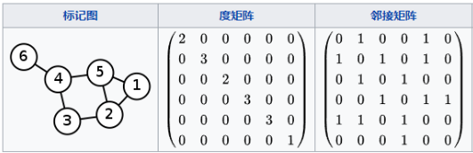
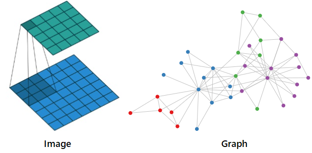
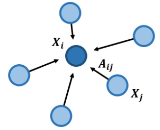
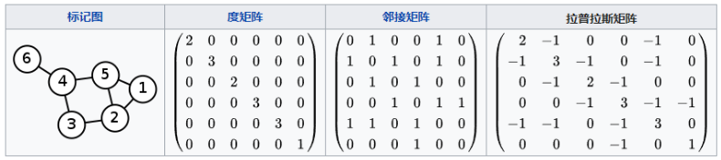

# 图卷积神经网络(GCN)理解与tensorflow2.0代码实现
代码对应的 CSDN 文章地址：https://blog.csdn.net/VariableX/article/details/109820684


图(Graph)，一般用 $G=(V,E)$ 表示，这里的$V$是图中节点的集合，$E$ 为边的集合，节点的个数用$N$表示。在一个图中，有三个比较重要的矩阵：

1. 特征矩阵$X$：维度为 $N\times D$ ，表示图中有N个节点，每个节点的特征个数是D。
2. 邻居矩阵$A$：维度为 $N\times N$ ，表示图中N个节点之间的连接关系。
3. 度矩阵 $D$：维度为 $N\times N$ ，是一个对角矩阵，即只有对角线上不为零，其他位置元素都是 0 ，表示图中N个节点与其他节点相连的边的个数。对于无权图而言，$D_{ii}=\sum_j  A_{ij}$ 。

邻接矩阵与度矩阵例子如下图所示：



对于图像(Image)数据，我们可以用卷积核来提取特征，无论卷积核覆盖在图像的哪个部分，其内部结构都是一样的，这是因为图片结构具有平移不变性，如下图左半部分所示：



但是对于图(Graph)数据而言，其形状是不规则的，不具有平移不变性。于是 GCN，也就是图卷积神经网络，其目标就是设计一种特征提取器，进而完成节点分类、变预测等任务，还顺便可以得到每个节点的 embedding 表示。

上面展示了一个简单的 3x3 的卷积核，每次自左向右，自上而下扫描图片(Image)时，都是将 3x3 的像素进行加权求和，即：$\sum_{i=1}^9  w_i x_i$，然后将求和的结果作为该 3x3 区域的特征。

那么在图(graph)中要怎么提取特征？这里给出两种思路。

## 图卷积

### 思路一

CNN加权求和的思想也可以应用到图(Graph)的特征提取上，如下图所示：



对于节点 $i$，我们可以用其邻接节点加权求和的结果来表示当前节点，这个操作我们称为“聚合(aggregate)”：
$$
agg(X_i) = \sum_{j \in neighbor(i)} A_{ij} X_j 
$$
考虑到与节点 $i$ 没有边连接的节点 $j$ ，对应的权重 $A_{ij}$ 为 0 ，因此上面的公式又可以改写为：
$$
agg(X_i) = \sum_{j \in N} A_{ij} X_j
$$
那么，对于所有的节点而言，其聚合的结果可以用下面的公式表示：
$$
agg(X) = AX
$$
上面的公式只考虑了邻居加权求和的结果，很多情况下，节点自身的信息是不可忽略的，因此一般情况下会把自身的特征也加回来：
$$
agg(X_i) = \sum_{j \in N} A_{ij} X_j + X_i
$$
于是有：
$$
agg(X) = AX +  X = (A+I)X
$$
其中，$I$ 是单位矩阵，令：
$$
\tilde A = A+I
$$
则有：
$$
agg(X) = \tilde AX
$$
也就是说把单位矩阵 $I$ 加到邻接矩阵 $A$ 上，即可在聚合操作中加入自身特征了。

现在有个问题，只能用自身节点以及邻居节点加权求和的结果来表示某个节点的特征吗？其实还有另一种思路。

### 思路二

在某些情况下，我们更关注节点之间的差值，因此可以对差值进行加权求和：
$$
\begin{aligned}
agg(X_i) & = \sum_{j \in N} A_{ij} (X_i -  X_j) \\
&= D_{ii}X_i- \sum_{j \in N} A_{ij}X_j \\
\end{aligned}
$$
其中，D 表示度矩阵，表示节点与其他节点相连的边的个数，对于无权图而言，$D_{ii}=\sum_j  A_{ij}$ 。

对于整个图的节点而言，上面的公式可以转换为矩阵化的表示：
$$
\begin{aligned}
agg(X) &= DX - AX \\
&= (D-A)X
\end{aligned}
$$
> 实际上，上面公式中的 $D-A$ 是拉普拉斯矩阵（用 $L$ 表示）：
> $$
> L = D - A
> $$
> 拉普拉斯矩阵如下图所示：
>
> 
>
> 如果想更多地了解拉普拉斯矩阵在GCN中的作用，可以参考：[如何理解 Graph Convolutional Network（GCN）？](https://www.zhihu.com/question/54504471/answer/630639025)

### 归一化

无论是思路一的 $\tilde A$ 还是思路二的 $L$，与CNN的卷积相似之处都是局部数据的聚合操作，只不过CNN 中卷积的局部连接数是固定的。但是在Graph中每个节点的邻居个数都可能不同，进行聚合操作后，对于度较大的节点，得到的特征比较大，度较少的节点得到的特征就比较小，因此还需要进行归一化的处理。

归一化的思路有两种：

（1）算数平均
$$
L^{rw}=D^{-1}L
$$
（2）几何平均
$$
L^{sym}=D^{-0.5}LD^{-0.5}
$$
几何平均受极端值影响较小，因此是GCN中比较常用的归一化方法，于是有：
$$
\begin{aligned}
agg(X) &= L^{sym} X \\
&= D^{-0.5}LD^{-0.5}X \\
&= D^{-0.5}(D-A)D^{-0.5} X
\end{aligned}
$$
当然也可以是：
$$
\begin{aligned}
agg(X) & = D^{-0.5}\tilde A D^{-0.5} X\\
& = D^{-0.5}(A+I)D^{-0.5} X
\end{aligned}
$$
在实际的GCN代码实现中，会对聚合结果进行一些变换，第 $l$ 层到第 $l+1$ 层的传播方式为：
$$
H^{(l+1)}=\sigma\left(\tilde{D}^{-\frac{1}{2}} \tilde{A} \tilde{D}^{-\frac{1}{2}} H^{(l)} W^{(l)}\right)
$$
其中：

- $\tilde A=A+I$ ，也可以是 $\tilde A = D - A$
- $\tilde D$ 是 $\tilde A$ 的度矩阵，每个元素为：$\tilde D_{ii}=\sum_j \tilde A_{ij}$
- $H$ 是每一层的特征，对于输入层而言，$H$ 就是 $X$
- σ 是 sigmoid 函数

由于 D 是在矩阵 A 的基础上得到的，因此在给定矩阵 A 之后，$\tilde{D}^{-\frac{1}{2}} \tilde{A} \tilde{D}^{-\frac{1}{2}}$ 就可以事先计算好。

## 代码实现

### Cora 数据集介绍

Cora数据集由机器学习论文组成，是近年来图深度学习很喜欢使用的数据集。整个数据集有2708篇论文，所有样本点被分为8个类别，类别分别是1）基于案例；2）遗传算法；3）神经网络；4）概率方法；5）强化学习；6）规则学习；7）理论。每篇论文都由一个1433维的词向量表示，所以，每个样本点具有1433个特征。词向量的每个元素都对应一个词，且该元素只有0或1两个取值。取0表示该元素对应的词不在论文中，取1表示在论文中。

### 定义图卷积层

```python
import tensorflow as tf
from tensorflow.keras import activations, regularizers, constraints, initializers

class GCNConv(tf.keras.layers.Layer):
    def __init__(self,
                 units,
                 activation=lambda x: x,
                 use_bias=True,
                 kernel_initializer='glorot_uniform',
                 bias_initializer='zeros',
                 **kwargs):
        super(GCNConv, self).__init__()

        self.units = units
        self.activation = activations.get(activation)
        self.use_bias = use_bias
        self.kernel_initializer = initializers.get(kernel_initializer)
        self.bias_initializer = initializers.get(bias_initializer)


    def build(self, input_shape):
        """ GCN has two inputs : [shape(An), shape(X)]
        """
        fdim = input_shape[1][1]  # feature dim
        # 初始化权重矩阵
        self.weight = self.add_weight(name="weight",
                                      shape=(fdim, self.units),
                                      initializer=self.kernel_initializer,
                                      trainable=True)
        if self.use_bias:
            # 初始化偏置项
            self.bias = self.add_weight(name="bias",
                                        shape=(self.units, ),
                                        initializer=self.bias_initializer,
                                        trainable=True)

    def call(self, inputs):
        """ GCN has two inputs : [An, X]
        """
        self.An = inputs[0]
        self.X = inputs[1]
        # 计算 XW
        if isinstance(self.X, tf.SparseTensor):
            h = tf.sparse.sparse_dense_matmul(self.X, self.weight)
        else:
            h = tf.matmul(self.X, self.weight)
        # 计算 AXW
        output = tf.sparse.sparse_dense_matmul(self.An, h)

        if self.use_bias:
            output = tf.nn.bias_add(output, self.bias)

        if self.activation:
            output = self.activation(output)

        return output
```

### 定义 GCN 模型

```python
class GCN():
    def __init__(self, An, X, sizes, **kwargs):
        self.with_relu = True
        self.with_bias = True

        self.lr = FLAGS.learning_rate
        self.dropout = FLAGS.dropout
        self.verbose = FLAGS.verbose
        
        self.An = An
        self.X = X
        self.layer_sizes = sizes
        self.shape = An.shape

        self.An_tf = sp_matrix_to_sp_tensor(self.An)
        self.X_tf = sp_matrix_to_sp_tensor(self.X)

        self.layer1 = GCNConv(self.layer_sizes[0], activation='relu')
        self.layer2 = GCNConv(self.layer_sizes[1])
        self.opt = tf.optimizers.Adam(learning_rate=self.lr)

    def train(self, idx_train, labels_train, idx_val, labels_val):
        K = labels_train.max() + 1
        train_losses = []
        val_losses = []
        # use adam to optimize
        for it in range(FLAGS.epochs):
            tic = time()
            with tf.GradientTape() as tape:
                _loss = self.loss_fn(idx_train, np.eye(K)[labels_train])

            # optimize over weights
            grad_list = tape.gradient(_loss, self.var_list)
            grads_and_vars = zip(grad_list, self.var_list)
            self.opt.apply_gradients(grads_and_vars)

            # evaluate on the training
            train_loss, train_acc = self.evaluate(idx_train, labels_train, training=True)
            train_losses.append(train_loss)
            val_loss, val_acc = self.evaluate(idx_val, labels_val, training=False)
            val_losses.append(val_loss)
            toc = time()
            if self.verbose:
                print("iter:{:03d}".format(it),
                      "train_loss:{:.4f}".format(train_loss),
                      "train_acc:{:.4f}".format(train_acc),
                      "val_loss:{:.4f}".format(val_loss),
                      "val_acc:{:.4f}".format(val_acc),
                      "time:{:.4f}".format(toc - tic))
        return train_losses

    def loss_fn(self, idx, labels, training=True):
        if training:
            # .nnz 是获得X中元素的个数
            _X = sparse_dropout(self.X_tf, self.dropout, [self.X.nnz])
        else:
            _X = self.X_tf

        self.h1 = self.layer1([self.An_tf, _X])
        if training:
            _h1 = tf.nn.dropout(self.h1, self.dropout)
        else:
            _h1 = self.h1

        self.h2 = self.layer2([self.An_tf, _h1])
        self.var_list = self.layer1.weights + self.layer2.weights
        # calculate the loss base on idx and labels
        _logits = tf.gather(self.h2, idx)
        _loss_per_node = tf.nn.softmax_cross_entropy_with_logits(labels=labels,
                                                                 logits=_logits)
        _loss = tf.reduce_mean(_loss_per_node)
        # 加上 l2 正则化项
        _loss += FLAGS.weight_decay * sum(map(tf.nn.l2_loss, self.layer1.weights))
        return _loss

    def evaluate(self, idx, true_labels, training):
        K = true_labels.max() + 1
        _loss = self.loss_fn(idx, np.eye(K)[true_labels], training=training).numpy()
        _pred_logits = tf.gather(self.h2, idx)
        _pred_labels = tf.argmax(_pred_logits, axis=1).numpy()
        _acc = accuracy_score(_pred_labels, true_labels)
        return _loss, _acc
```

### 训练模型

```python
# 计算标准化的邻接矩阵：根号D * A * 根号D
def preprocess_graph(adj):
    # _A = A + I
    _adj = adj + sp.eye(adj.shape[0])
    # _dseq：各个节点的度构成的列表
    _dseq = _adj.sum(1).A1
    # 构造开根号的度矩阵
    _D_half = sp.diags(np.power(_dseq, -0.5))
    # 计算标准化的邻接矩阵, @ 表示矩阵乘法
    adj_normalized = _D_half @ _adj @ _D_half
    return adj_normalized.tocsr()

if __name__ == "__main__":
    # 读取数据
    # A_mat：邻接矩阵，以scipy的csr形式存储
    # X_mat：特征矩阵，以scipy的csr形式存储
    # z_vec：label
    # train_idx,val_idx,test_idx: 要使用的节点序号
    A_mat, X_mat, z_vec, train_idx, val_idx, test_idx = load_data_planetoid(FLAGS.dataset)
    # 邻居矩阵标准化
    An_mat = preprocess_graph(A_mat)

    # 节点的类别个数
    K = z_vec.max() + 1

    # 构造GCN模型
    gcn = GCN(An_mat, X_mat, [FLAGS.hidden1, K])
    # 训练
    gcn.train(train_idx, z_vec[train_idx], val_idx, z_vec[val_idx])
    # 测试
    test_res = gcn.evaluate(test_idx, z_vec[test_idx], training=False)
    print("Dataset {}".format(FLAGS.dataset),
          "Test loss {:.4f}".format(test_res[0]),
          "test acc {:.4f}".format(test_res[1]))
```

## GCN 小结

GCN的优点： 可以捕捉graph的全局信息，从而很好地表示node的特征。

GCN的缺点：属于直推式(transductive)的学习方式，需要把所有节点都参与训练才能得到node embedding，无法快速得到新node的embedding。如果要得到新节点的表示，很可能就需要重新训练所有节点的表示。


参考文章：

[如何理解 Graph Convolutional Network（GCN）？](https://www.zhihu.com/question/54504471/answer/611222866)

[2020年，我终于决定入门GCN](https://zhuanlan.zhihu.com/p/112277874)

[GCN(Graph Convolutional Network)的理解](https://purelyvivid.github.io/2019/07/07/GCN_1/)


